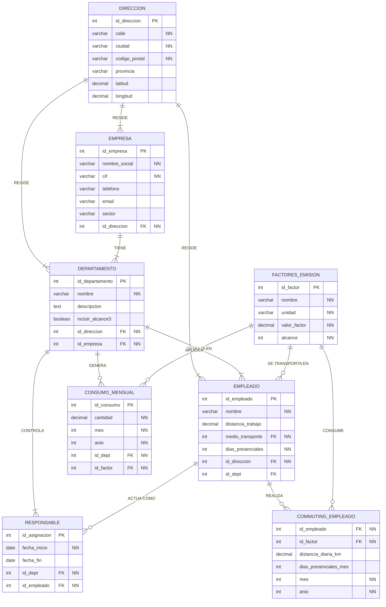

```mermaid
erDiagram
    DIRECCION ||--|{ EMPRESA: "RESIDE"
    DIRECCION ||--|{ DEPARTAMENTO: "RESIDE"
    DIRECCION ||--|{ EMPLEADO: "RESIDE"
    EMPRESA ||--|{ DEPARTAMENTO: "TIENE"
    DEPARTAMENTO ||--|{ EMPLEADO: "TRABAJA EN"
    DEPARTAMENTO ||--|{ RESPONSABLE: "CONTROLA"
    DEPARTAMENTO ||--o{ CONSUMO_MENSUAL: "GENERA"
    EMPLEADO ||--o{ RESPONSABLE: "ACTUA COMO"
    EMPLEADO ||--o{ COMMUTING_EMPLEADO: "REALIZA"
    FACTORES_EMISION ||--o{ EMPLEADO: "SE TRANSPORTA EN"
    FACTORES_EMISION ||--o{ CONSUMO_MENSUAL: "APLICA A"
    FACTORES_EMISION ||--o{ COMMUTING_EMPLEADO: "CONSUME"

    DIRECCION {
        int id_direccion PK
        varchar calle "NN"
        varchar ciudad "NN"
        varchar codigo_postal "NN"
        varchar provincia
        decimal latitud
        decimal longitud
    }

    EMPRESA {
        int id_empresa PK
        varchar nombre_social "NN"
        varchar cif "NN"
        varchar telefono
        varchar email
        varchar sector
        int id_direccion FK "NN"
    }

    DEPARTAMENTO {
        int id_departamento PK
        varchar nombre "NN"
        text descripcion
        boolean incluir_alcance3
        int id_direccion FK "NN"
        int id_empresa FK "NN"
    }

    EMPLEADO {
        int id_empleado PK
        varchar nombre "NN"
        decimal distancia_trabajo
        int medio_transporte FK "NN"
        int dias_presenciales "NN"
        int id_direccion FK "NN"
        int id_dept FK
    }

    RESPONSABLE {
        int id_asignacion PK
        date fecha_inicio "NN"
        date fecha_fin
        int id_dept FK "NN"
        int id_empleado FK "NN"
    }

    FACTORES_EMISION {
        int id_factor PK
        varchar nombre "NN"
        varchar unidad "NN"
        decimal valor_factor "NN"
        int alcance "NN"
    }

    CONSUMO_MENSUAL {
        int id_consumo PK
        decimal cantidad "NN"
        int mes "NN"
        int anio "NN"
        int id_dept FK "NN"
        int id_factor FK "NN"
    }

    COMMUTING_EMPLEADO {
        int id_empleado FK "NN"
        int id_factor FK "NN"
        decimal distancia_diaria_km
        int dias_presenciales_mes
        int mes "NN"
        int anio "NN"
    }
```
